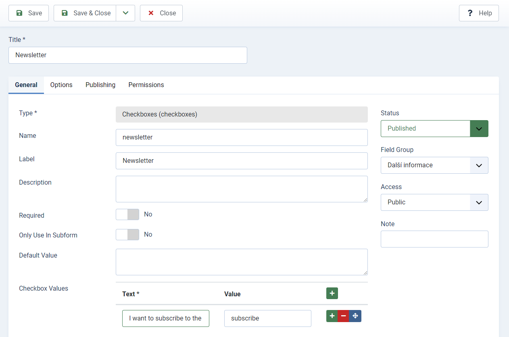

# Ecomail for Joomla
A plugin for the integration of Joomla registration form with [Ecomail](https://ecomail.cz?fpr=petbe).
Subscribe users during registration on the website.

### Features:
- **automatic** od **opt-in** mode (user may be subscribed automatically or by clicking on a checkbox)
- option to name and surname collection
- option to update existing contacts
- option to resubscribe
- option to skip double opt-in
- option to run automations when user is subscribed

#### Automatic mode
- user is subscribed automatically on successful registration

#### Opt-in mode
- user is subscribed only if he choose to by click on a checkbox
- user can manage his opt-in consent in profile settings (it uses Joomla native custom fields)

### How to add subscribe checkbox to the registration form
Follow this instructions if you choose **opt-in** mode
- create a user custom field type *checkbox* (Users->Fields->New)
- add a checkbox text you wish and value, value **__must be exact "subscribe"__**

Example:

### Compatibillity:
- Joomla 4
- Joomla 5

This plugin use official PHP library for dealing with Ecomail API https://github.com/Ecomailcz/ecomail-php

### Support
You can support my work by purchasing an Ecomail subscription through that link: https://ecomail.cz?fpr=petbe

Or you can [Buy Me a Coffe](https://www.buymeacoffee.com/petrbenes)
